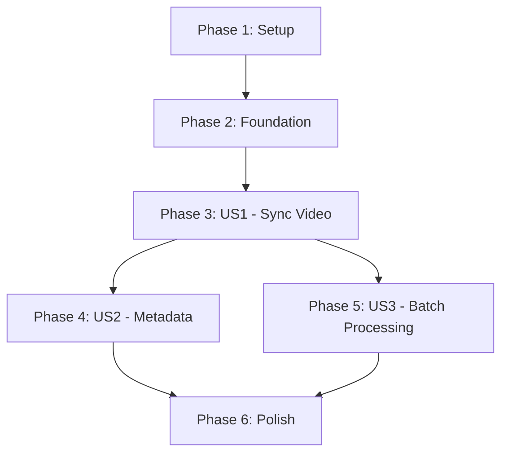

# Implementation Tasks: Automated Torah Reading Audio-Visual Synchronization

**Feature**: 001-torah-audio-text-sync
**Date**: 2026-02-01
**Status**: Ready for Implementation

## Overview

This document provides a dependency-ordered, actionable task breakdown for implementing the Torah audio-visual synchronization feature. Tasks are organized by user story to enable independent implementation and testing of each increment.

**Total Estimated Tasks**: 65
**MVP Scope**: User Story 1 (Tasks T001-T035) - Single Aliyah synchronized video generation
**Implementation Strategy**: Incremental delivery by user story, with each story independently testable

## Phase 1: Project Setup & Infrastructure

**Goal**: Establish project structure, dependencies, and foundational configuration
**Completion Criteria**: Project can be initialized, dependencies installed, and basic imports work

### Setup Tasks

- [x] T001 Create project directory structure per plan.md (src/, tests/, data/, output/, fonts/)
- [x] T002 Initialize pyproject.toml with Python 3.13 and core dependencies (aeneas, moviepy, httpx, pydub, dynaconf, pydantic, pytest)
- [x] T003 Create .gitignore excluding data/cache/, output/, .venv/, *.pyc, .secrets.toml
- [x] T004 Download and bundle Hebrew font (FrankRuhl-Regular.ttf) to fonts/ directory
- [x] T005 Create settings.toml with default configuration per research.md (video resolution, Sefaria URL, cache dirs)
- [x] T006 Create .secrets.toml.example template for sensitive configuration
- [x] T007 Set up pre-commit hooks configuration (.pre-commit-config.yaml) with ruff, mypy, pytest
- [x] T008 Create README.md with project overview and quickstart instructions
- [x] T009 Initialize UV virtual environment and verify all dependencies install correctly
- [x] T010 Create output directory structure (videos/, logs/, errors/, timestamp_maps/)

## Phase 2: Foundational Components

**Goal**: Implement core data models and shared utilities required by all user stories
**Completion Criteria**: All models validate correctly, configuration loads, logging works, shared utilities tested

### Foundational Tasks

- [x] T011 [P] Create Pasuk (Verse) Pydantic model in src/models/pasuk.py with validation per data-model.md
- [x] T012 [P] Create VerseTimestamp embedded model in src/models/timestamp.py
- [x] T013 [P] Create TimestampMap Pydantic model in src/models/timestamp_map.py with monotonic timestamp validation
- [x] T014 [P] Create Aliyah Pydantic model in src/models/aliyah.py with state transitions enum
- [x] T015 [P] Create Parasha Pydantic model in src/models/parasha.py
- [x] T016 [P] Create HebrewTextSource protocol in src/models/hebrew_text_source.py
- [x] T017 [P] Create AudioSource model in src/models/audio_source.py
- [x] T018 [P] Create SynchronizedVideo model in src/models/video.py
- [x] T019 Create configuration loader in src/lib/config.py using dynaconf with environment variable support
- [x] T020 Create structured logging setup in src/lib/logging.py using loguru with automatic JSON serialization
- [x] T021 Create custom exception classes in src/lib/exceptions.py (HebrewTextUnavailableError, InvalidReferenceError, etc.)
- [x] T022 Create filename parser utility in src/lib/filename_parser.py to extract Parasha/Aliyah from Hebrew naming convention
- [x] T023 Create Hebrew text validator in src/lib/hebrew_validator.py to verify Unicode Nikkud (U+05B0-U+05BD) and T'amim (U+0591-U+05AF) presence

## Phase 3: User Story 1 - View Synchronized Torah Reading Video (P1)

**Goal**: Generate a synchronized video for a single Aliyah where Hebrew text highlights in real-time with audio
**User Story**: A student of Torah reading wants to practice their chanting by following along with a visual guide
**Independent Test**: Process one audio file (e.g., "פרשת האזינו - ראשון - נוסח אשכנז.mp4") and verify verse highlighting synchronizes with audio playback
**Value Delivered**: Core feature - enables users to visually follow professional Torah readings

### Audio Processing Module

- [ ] T024 [US1] Create AudioFileReader class in src/services/audio/reader.py to load MP3/MP4/WAV files using pydub
- [ ] T025 [US1] Implement audio format detection in src/services/audio/reader.py (validate file exists and is readable)
- [ ] T026 [US1] Implement audio metadata extraction (duration, sample rate, channels) in src/services/audio/reader.py
- [ ] T027 [US1] Create AudioConverter class in src/services/audio/converter.py to convert audio to 16kHz mono WAV per research.md
- [ ] T028 [US1] Implement temporary file management in src/services/audio/converter.py for converted audio cleanup

### Hebrew Text Retrieval Module

- [ ] T029 [US1] Create SefariaClient class in src/services/text/sefaria_client.py with base URL configuration
- [ ] T030 [US1] Implement get_verse() method in src/services/text/sefaria_client.py using httpx per contracts/sefaria-api.md
- [ ] T031 [US1] Implement get_range() method in src/services/text/sefaria_client.py for multi-verse retrieval
- [ ] T032 [US1] Implement retry logic with exponential backoff (3 attempts, 2s/4s/8s delays) in src/services/text/sefaria_client.py
- [ ] T033 [US1] Implement Sefaria response validation in src/services/text/sefaria_client.py (check for Nikkud and T'amim using lib/hebrew_validator.py)
- [ ] T034 [US1] Implement file-based caching in src/services/text/cache.py (save responses to data/cache/sefaria/{book}_{chapter}_{verse}.json)
- [ ] T035 [US1] Implement error handling per FR-002a in src/services/text/sefaria_client.py (fail with clear message when API unavailable)

### Forced Alignment Module

- [ ] T036 [US1] Create AlignmentEngine class in src/services/alignment/engine.py wrapping aeneas library
- [ ] T037 [US1] Implement prepare_text_for_alignment() in src/services/alignment/engine.py (format verses for aeneas input)
- [ ] T038 [US1] Implement run_alignment() in src/services/alignment/engine.py to generate verse-level timestamps
- [ ] T039 [US1] Implement alignment quality scoring in src/services/alignment/engine.py (calculate confidence score 0.0-1.0)
- [ ] T040 [US1] Implement timestamp validation in src/services/alignment/engine.py (check monotonic increase, no gaps >5s, no overlaps)
- [ ] T041 [US1] Implement TimestampMap serialization in src/services/alignment/engine.py (save to JSON per data-model.md)
- [ ] T042 [US1] Implement alignment failure handling in src/services/alignment/engine.py (raise exception if confidence < 0.90)

### Video Rendering Module

- [ ] T043 [US1] Create VideoRenderer class in src/services/video/renderer.py using moviepy
- [ ] T044 [US1] Implement font loading in src/services/video/renderer.py (load FrankRuhl-Regular.ttf with size 18-24pt)
- [ ] T045 [US1] Implement Hebrew text layout in src/services/video/renderer.py (calculate positions for multiple verses on screen)
- [ ] T046 [US1] Implement verse highlighting logic in src/services/video/renderer.py (apply color/opacity changes based on timestamps)
- [ ] T047 [US1] Implement scrolling animation in src/services/video/renderer.py (auto-scroll to keep highlighted verse centered)
- [ ] T048 [US1] Implement video composition in src/services/video/renderer.py (combine audio track + text overlay at 30fps)
- [ ] T049 [US1] Implement video encoding in src/services/video/renderer.py (MP4 with H.264 codec, 640x360 resolution, CRF 23)
- [ ] T050 [US1] Implement output validation in src/services/video/renderer.py (verify resolution, duration, codec) - must be valid to upload to youtube

### Pipeline Orchestration

- [ ] T051 [US1] Create ProcessingPipeline class in src/services/pipeline.py to orchestrate all modules
- [ ] T052 [US1] Implement process_single_aliyah() method in src/services/pipeline.py (parse filename → retrieve text → align → render)
- [ ] T053 [US1] Implement progress logging in src/services/pipeline.py (log each pipeline stage with structured data)
- [ ] T054 [US1] Implement error recovery in src/services/pipeline.py (cleanup temp files, log failures)
- [ ] T055 [US1] Implement state tracking in src/services/pipeline.py (update Aliyah state: pending → aligning → aligned → rendering → completed/failed)

### CLI Interface (User Story 1 Subset)

- [ ] T056 [US1] Create CLI entry point in src/cli/main.py using argparse or click
- [ ] T057 [US1] Implement single file processing command in src/cli/main.py per contracts/cli-interface.md
- [ ] T058 [US1] Implement argument parsing in src/cli/main.py (AUDIO_FILE, --output, --cache-dir, --font, --log-level)
- [ ] T059 [US1] Implement filename validation in src/cli/main.py (reject files not matching Hebrew naming convention)
- [ ] T060 [US1] Implement exit code handling in src/cli/main.py (0=success, 1-8=specific errors per contract)
- [ ] T061 [US1] Implement stdout/stderr separation in src/cli/main.py (progress to stdout, errors to stderr)
- [ ] T062 [US1] Wire CLI to ProcessingPipeline in src/cli/main.py
- [ ] T063 [US1] Implement --help and --version flags in src/cli/main.py

### Integration Testing (User Story 1)

- [ ] T064 [US1] Create end-to-end integration test in tests/integration/test_us1_pipeline.py (process sample Haazinu Rishon audio file)
- [ ] T065 [US1] Verify test output video in tests/integration/test_us1_pipeline.py (check resolution 640x360, MP4 format, duration matches audio)
- [ ] T066 [US1] Verify verse highlighting timing in tests/integration/test_us1_pipeline.py (sample timestamp checks within 0.5s accuracy)
- [ ] T067 [US1] Verify Hebrew text readability in tests/integration/test_us1_pipeline.py (diacritical marks visible in rendered frames)

## Phase 4: User Story 2 - Identify Context Within Torah Portion (P2)

**Goal**: Display Parasha name, Aliyah name, and current verse reference as persistent metadata overlay
**User Story**: A user watching a Torah reading video wants to know which Parasha, Aliyah, and verse they are viewing
**Independent Test**: Play any generated video and verify metadata (Parasha, Aliyah, verse reference) is visible and updates correctly
**Dependencies**: Requires User Story 1 (video rendering pipeline must exist)
**Value Delivered**: Contextual information enhances learning without requiring prior Torah structure knowledge

### Metadata Display Module

- [ ] T068 [P] [US2] Create MetadataFormatter class in src/services/video/metadata_formatter.py to format Parasha/Aliyah names
- [ ] T069 [P] [US2] Implement Hebrew-to-English transliteration in src/services/video/metadata_formatter.py (e.g., "האזינו" → "Haazinu")
- [ ] T070 [P] [US2] Implement verse reference formatting in src/services/video/metadata_formatter.py (e.g., "Deuteronomy 32:1")
- [ ] T071 [US2] Create MetadataOverlay class in src/services/video/metadata_overlay.py extending VideoRenderer
- [ ] T072 [US2] Implement static metadata rendering in src/services/video/metadata_overlay.py (Parasha/Aliyah names at top of frame)
- [ ] T073 [US2] Implement dynamic verse reference rendering in src/services/video/metadata_overlay.py (updates on verse transitions)
- [ ] T074 [US2] Integrate MetadataOverlay into VideoRenderer in src/services/video/renderer.py
- [ ] T075 [US2] Update video composition in src/services/video/renderer.py to layer metadata on top of text

### Integration Testing (User Story 2)

- [ ] T076 [US2] Create integration test in tests/integration/test_us2_metadata.py (verify metadata visibility throughout video)
- [ ] T077 [US2] Verify metadata updates in tests/integration/test_us2_metadata.py (check verse reference changes at transitions)
- [ ] T078 [US2] Verify metadata readability in tests/integration/test_us2_metadata.py (contrast, font size, positioning)

## Phase 5: User Story 3 - Process Multiple Torah Portions (P3)

**Goal**: Enable batch processing of multiple Parasha audio files to generate full Torah coverage
**User Story**: A content creator wants to generate synchronized videos for all Torah portions
**Independent Test**: Process multiple Parasha files (different Parashot and Aliyot) and verify each produces correctly synchronized output
**Dependencies**: Requires User Stories 1 & 2 (single file processing must work)
**Value Delivered**: Scalability to comprehensive educational content library

### Batch Processing Module

- [ ] T079 [P] [US3] Create BatchProcessor class in src/services/batch/processor.py
- [ ] T080 [P] [US3] Implement directory scanning in src/services/batch/processor.py (find all valid audio files)
- [ ] T081 [P] [US3] Implement file filtering in src/services/batch/processor.py (skip invalid filenames, log warnings)
- [ ] T082 [US3] Implement parallel processing in src/services/batch/processor.py (use multiprocessing.Pool with configurable worker count)
- [ ] T083 [US3] Implement progress tracking in src/services/batch/processor.py (count completed/failed/remaining)
- [ ] T084 [US3] Implement batch summary generation in src/services/batch/processor.py (total files, successful, failed counts)
- [ ] T085 [US3] Implement error manifest generation in src/services/batch/processor.py (save failed_items.json per contracts/cli-interface.md)

### CLI Batch Mode

- [ ] T086 [US3] Implement batch command in src/cli/main.py (torah-sync batch AUDIO_DIR)
- [ ] T087 [US3] Implement --parallel flag in src/cli/main.py (default=1, max=CPU count)
- [ ] T088 [US3] Implement --retry-failed flag in src/cli/main.py (read failed_items.json and reprocess)
- [ ] T089 [US3] Wire batch command to BatchProcessor in src/cli/main.py
- [ ] T090 [US3] Implement batch progress output in src/cli/main.py (show N/M completed)

### Integration Testing (User Story 3)

- [ ] T091 [US3] Create batch integration test in tests/integration/test_us3_batch.py (process 3+ audio files from different Parashot)
- [ ] T092 [US3] Verify parallel processing in tests/integration/test_us3_batch.py (check multiple workers execute correctly)
- [ ] T093 [US3] Verify error handling in tests/integration/test_us3_batch.py (test with invalid file, verify manifest generated)
- [ ] T094 [US3] Verify retry mechanism in tests/integration/test_us3_batch.py (test --retry-failed with manifest)

## Phase 6: Polish & Cross-Cutting Concerns

**Goal**: Add production-ready features, JSON output, comprehensive error handling, and documentation
**Completion Criteria**: CLI supports all contract features, errors handled gracefully, documentation complete

### Enhanced Error Handling

- [ ] T095 [P] Add context to all exceptions in src/lib/exceptions.py (file paths, stack traces, timestamps)
- [ ] T096 [P] Implement error recovery strategies in src/services/pipeline.py (cleanup partial outputs on failure)
- [ ] T097 Implement validation for edge cases in src/services/alignment/engine.py (handle pauses, non-text vocalizations)

### JSON Output Support

- [ ] T098 [P] Create JSONOutputFormatter in src/cli/json_formatter.py
- [ ] T099 [P] Implement success response schema in src/cli/json_formatter.py per contracts/cli-interface.md
- [ ] T100 [P] Implement error response schema in src/cli/json_formatter.py
- [ ] T101 [P] Implement batch summary schema in src/cli/json_formatter.py
- [ ] T102 Integrate --json flag in src/cli/main.py (suppress human-readable output, emit JSON to stdout)

### Configuration Enhancements

- [ ] T103 [P] Add user config file support in src/lib/config.py (~/.torah-sync.toml loading)
- [ ] T104 [P] Implement environment variable overrides in src/lib/config.py (TORAH_SYNC_* prefix)
- [ ] T105 Implement CLI argument precedence in src/lib/config.py (CLI args > env vars > user config > defaults)

### Documentation & Finalization

- [ ] T106 [P] Create API documentation in docs/api.md (document all public classes and methods)
- [ ] T107 [P] Create troubleshooting guide in docs/troubleshooting.md (expand on quickstart.md error scenarios)
- [ ] T108 [P] Add inline code documentation (docstrings) to all public functions following Google style
- [ ] T109 Update README.md with complete usage examples and architecture diagram
- [ ] T110 Create CONTRIBUTING.md with development setup and TDD guidelines

### Performance Optimization

- [ ] T111 Profile pipeline in tests/performance/test_performance.py (measure processing time per Aliyah)
- [ ] T112 Optimize video rendering in src/services/video/renderer.py if processing time exceeds 5 minutes per Aliyah
- [ ] T113 Implement memory profiling in src/services/video/renderer.py (verify <2GB RAM usage during rendering)

### Final Validation

- [ ] T114 Run complete Torah portion (7 Aliyot) through pipeline in tests/integration/test_full_parasha.py
- [ ] T115 Verify success criteria SC-001 through SC-008 from spec.md against output videos
- [ ] T116 Verify constitution compliance (file size ≤2048 tokens, cyclomatic complexity ≤10, type hints, coverage ≥90%)
- [ ] T117 Run all pre-commit hooks and ensure zero violations
- [ ] T118 Generate final test coverage report and verify ≥90% threshold

## Dependencies & Execution Order

### User Story Dependencies



**Critical Path**: Setup → Foundation → US1 → US2 → Polish
**Parallel Opportunities**: US2 and US3 can be developed simultaneously after US1 completes

### Phase-Level Blocking Dependencies

- **Phase 2** BLOCKS **Phase 3**: Data models must exist before services can use them
- **Phase 3 (US1)** BLOCKS **Phases 4 & 5**: Core pipeline must work before metadata/batch features
- **Phases 4 & 5** are INDEPENDENT: Can be developed in parallel
- **Phase 6** BLOCKS on **Phases 3, 4, 5**: Polish requires all features implemented

### Parallel Execution Examples

**Within Phase 2 (Foundation)**:
```bash
# All model creation tasks (T011-T018) can run in parallel
parallel uv run pytest tests/unit/models/test_{}.py ::: pasuk timestamp aliyah parasha
```

**Within Phase 3 (US1)**:
```bash
# Audio, Text, and Alignment modules can be developed in parallel
# as they have no inter-dependencies
Team Member 1: T024-T028 (Audio Processing)
Team Member 2: T029-T035 (Text Retrieval)
Team Member 3: T036-T042 (Alignment)
# Then converge on T043-T050 (Video Rendering)
```

**Across Phases 4 & 5**:
```bash
# US2 and US3 can be developed completely independently
Team/Branch A: T068-T078 (Metadata Display)
Team/Branch B: T079-T094 (Batch Processing)
```

## Testing Strategy

### Test Organization

```
tests/
├── unit/              # Fast, isolated tests for individual functions
│   ├── models/       # Pydantic model validation tests
│   ├── services/     # Service layer tests (mocked dependencies)
│   └── lib/          # Utility function tests
├── contract/         # API contract tests (Sefaria, CLI interface)
│   ├── test_sefaria_api.py
│   └── test_cli_interface.py
└── integration/      # End-to-end pipeline tests
    ├── test_us1_pipeline.py
    ├── test_us2_metadata.py
    ├── test_us3_batch.py
    └── test_full_parasha.py
```

### Test Requirements Per Constitution

- **Coverage Target**: ≥90% for all new code
- **TDD Methodology**: Write tests BEFORE implementation (test files created with task number)
- **Test Naming**: `test_{module}_{function}_{scenario}.py`
- **Assertions**: Use pytest fixtures, parametrize for multiple scenarios
- **style**: Use flat tests - not classes

### Sample Test Data

Required sample files (to be placed in `tests/fixtures/`):
- `פרשת האזינו - ראשון - נוסח אשכנז.mp4` (Haazinu Rishon - primary test case)
- `פרשת האזינו - שני - נוסח אשכנז.mp3` (Haazinu Sheni - secondary test case)
- `invalid_name.mp4` (negative test - invalid filename)
- Expected timestamp map JSONs for validation
- Reference video frames for visual regression testing

## Implementation Notes

### Task ID Format

- **TXX**: Sequential task number (001-118)
- **[P]**: Parallelizable (no dependencies on incomplete tasks, different files)
- **[USX]**: User Story label (US1=User Story 1, US2=User Story 2, US3=User Story 3)

### File Path Convention

All tasks include explicit file paths (e.g., `src/models/pasuk.py`) to enable autonomous implementation.

### Checklist Format

Tasks use strict markdown checklist format for tracking:
- Uncompleted: `- [ ] T001 Description`
- Completed: `- [x] T001 Description`

### Suggested MVP (Minimum Viable Product)

**Scope**: Phase 1 + Phase 2 + Phase 3 (Tasks T001-T067)
**Deliverable**: CLI that processes a single audio file and generates a synchronized video
**Value**: Demonstrates core feature (FR-001 through FR-006)
**Duration**: Approximately 40-60 implementation hours (excluding testing time)

### Incremental Delivery Milestones

1. **Milestone 1 (T001-T023)**: Project initialized, models defined, can load config and parse filenames
2. **Milestone 2 (T024-T042)**: Audio processing, text retrieval, and alignment working independently
3. **Milestone 3 (T043-T067)**: End-to-end pipeline produces synchronized videos (US1 complete) ← **MVP**
4. **Milestone 4 (T068-T078)**: Metadata overlay functional (US2 complete)
5. **Milestone 5 (T079-T094)**: Batch processing operational (US3 complete)
6. **Milestone 6 (T095-T118)**: Production-ready with polish, documentation, full validation

## Success Validation

Upon task completion, verify:

1. ✅ All tasks marked `[x]` in checklist
2. ✅ All unit tests pass (`uv run pytest tests/unit/`)
3. ✅ All contract tests pass (`uv run pytest tests/contract/`)
4. ✅ All integration tests pass (`uv run pytest tests/integration/`)
5. ✅ Test coverage ≥90% (`uv run pytest --cov=src --cov-report=term`)
6. ✅ Type checking passes (`uv run mypy src/`)
7. ✅ Linting passes (`uv run ruff check .`)
8. ✅ Pre-commit hooks pass (`uv run pre-commit run --all-files`)
9. ✅ Success criteria SC-001 through SC-008 from spec.md validated
10. ✅ Sample video (Haazinu Rishon) renders successfully with proper synchronization

## Notes

- All Python commands MUST use `uv run` prefix per constitution (e.g., `uv run pytest`, `uv run torah-sync`)
- Follow TDD methodology: Write test first, implement to pass test, refactor
- Keep files under 2048 tokens (split into smaller modules if needed)
- Use f-string logging with `=` operator: `logger.debug(f"{user_id=}, {status=}")`
- No empty `__init__.py` files (implicit namespace packages)
- All code generated by Claude must include comment: `# Generated by Claude Code` or `# Edited by Claude Code`

---

**Ready for `/speckit.implement` or manual task execution**
